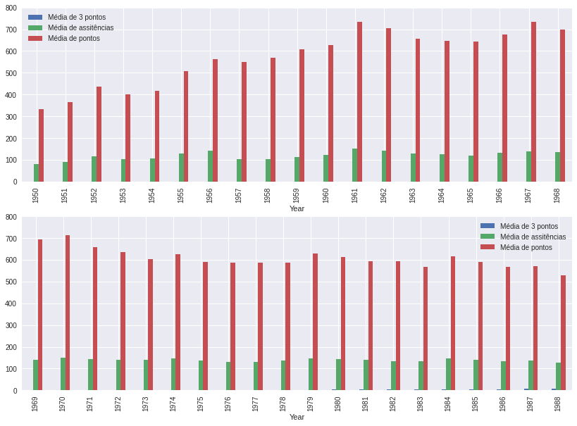
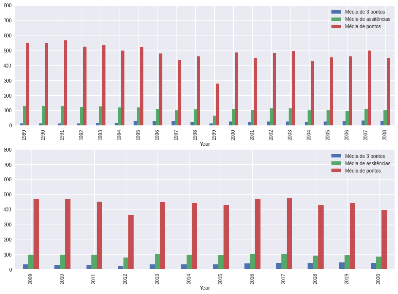

# Análise de dados NBA

Projeto de análise de dados da NBA dos últimos 70 anos, indo de 1950 até 2020.

## Organização do notebook

O notebook utilizada para a análise é divido em duas partes. A primeira foca nos números da temporada, avaliando as diferenças com o passar do tempo em alguns fundamentos básico do basquete, como pontuação e bloqueio, tentando atráves dos dados entender as mudanças na NBA ao longo das temporadas

Na segunda parte há um enfoque nos jogadores, tentando entender os principais jogadores de cada fundamento e tentando entender se esses dados confirmam as infidáveis listas de maiores de todos os tempos dos especialistas.

## Requisitos

Esse projeto utilizou as bibliotecas [Pandas](https://pandas.pydata.org/), [Matplotlib](https://matplotlib.org/), [Requests](https://docs.python-requests.org/en/master/), [BeautifulSoup](https://www.crummy.com/software/BeautifulSoup/bs4/doc/) e [Seaborn](https://seaborn.pydata.org/)

## Licença

MIT, veja [ela](https://github.com/fhfraga/Analise_NBA/blob/master/LICENSE)
